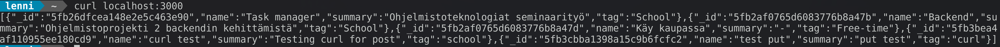
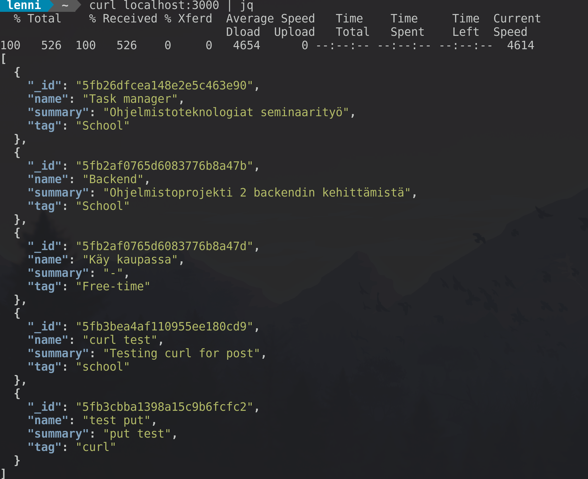

# Simple taskmanager to use with curl

## Before using

Create .env file and specify port number and your mongodb uri

```
DATABASE_URI=mongodb+srv://dbAdmin:<dbpassword>@cluster0.2ojpx.mongodb.net/<dbname>?retryWrites=true&w=majority
PORT=<Your port number>
```

Run `npm install` on project root directory

### Suggested programs

jq is a tool for processing JSON inputs

[jq download page](https://stedolan.github.io/jq/download/)

Debian/Ubuntu `sudo apt install jq`

Arch/Manjaro `sudo pacman -S jq`

### Without jq



### With jq



## Curl options

### GET

```
curl localhost:PORT_NUMBER | jq
```

### GET by tag

```
curl localhost:PORT_NUMBER/tag | jq
```

### POST

```
curl -X POST -H "Content-Type: application/json" -d {
    "name": "Name of task",
    "summary": "something extra to add"
    "tag": "tag of task like work, chores, school etc"
} localhost:PORT_NUMBER
```

### PUT

```
curl -X PUT -H "Content-Type: application/json" -d{
    "name": "Name of task",
    "summary": "something extra to add"
    "tag": "tag of task like work, chores, school etc"
} localhost:PORT_NUMBER/id
```

### DELETE

```
curl -X DELETE localhost:PORT_NUMBER/id
```
